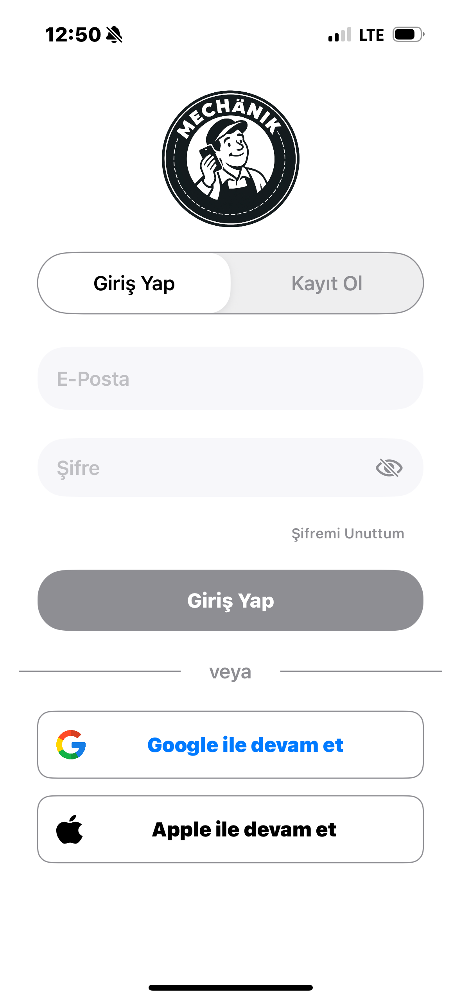
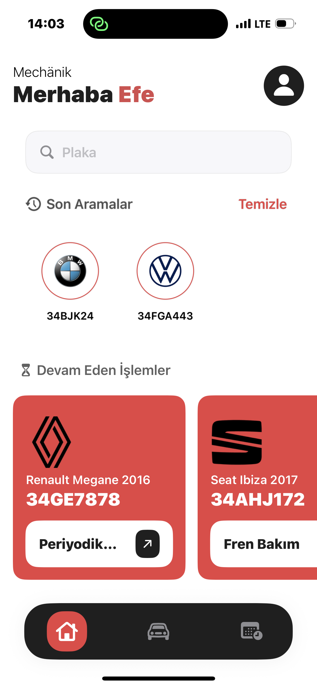
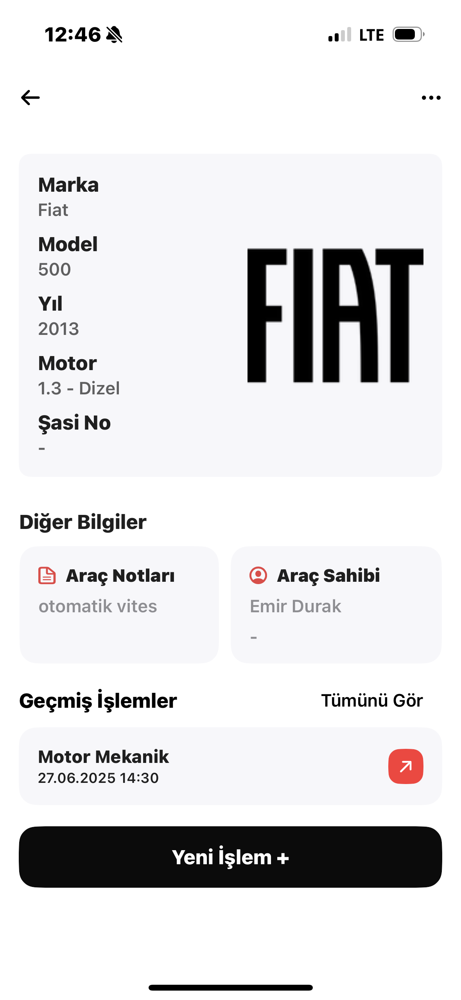
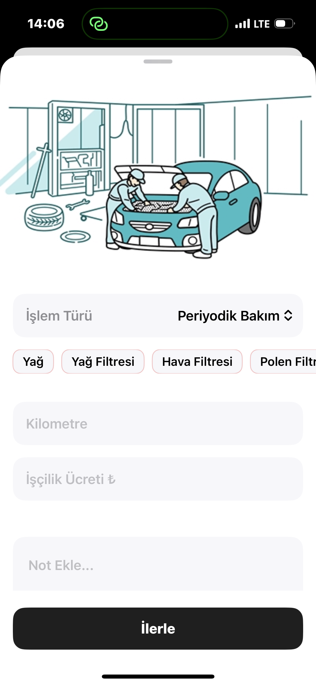
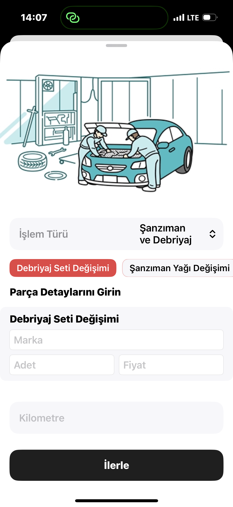
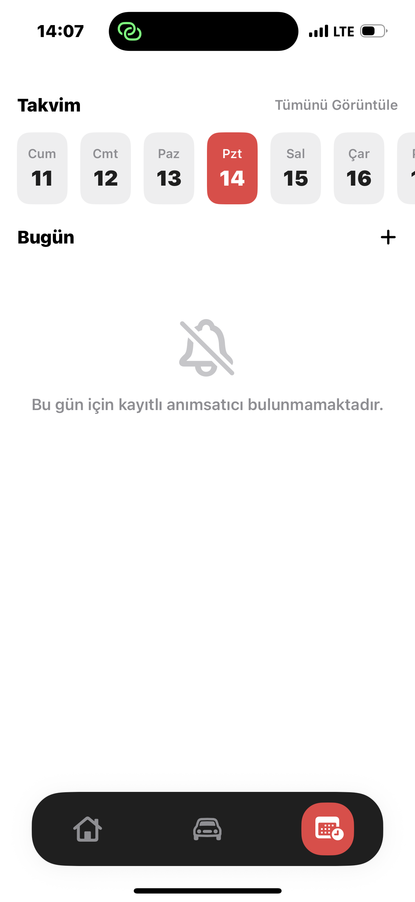

# Mechänik

Bu uygulama, üniversite bitirme projem olarak geliştirildi. Swift ve SwiftUI öğrenme sürecimle eş zamanlı olarak kodlandı. Projeyi yazarken hem mobil programlama temellerini hem de Firebase gibi servisleri uygulamalı olarak öğrenmeyi hedefledim. Kod yapısında eksikler veya iyileştirme alanları olabilir; bu proje benim için aynı zamanda bir öğrenme yolculuğuydu.

Mechänik, araç servis işletmelerinin müşteri, işlem ve araç takibini kolaylaştırmak amacıyla geliştirilen sade ve işlevsel bir mobil uygulamadır.
---

## 🚀 Özellikler

- Araç kaydı ekleme ve güncelleme
- Servis geçmişi ve yapılan işlemleri görüntüleme
- Devam eden işlemleri takip etme
- Anımsatıcı sistemi
- Marka ve model seçimli form yapısı
- Firebase Auth, Firestore ve Storage entegrasyonu

---

## 📱 Ekran Görüntüleri

<!-- Buraya `/Screenshots` klasörüne koyacağın ekran görüntüleri eklenecek -->
<p float="left">
  
  
  
  
  
  
  
</p>

---

## 🔧 Kurulum

### 1. Projeyi klonla

```bash
git clone https://github.com/efarslan/Mechänik.git
```
### 2. Firebase Projesi Oluştur

- [Firebase Console](https://console.firebase.google.com) üzerinden yeni bir proje oluştur.
- iOS platformunu seç ve Bundle ID olarak `com.efearslan.Mechänik` kullan.
- Oluşturulan `GoogleService-Info.plist` dosyasını indir ve Xcode projesine **drag & drop** ile ekle.
- Bu dosya `.gitignore` ile korunmaktadır, GitHub’a yüklenmemiştir.

### 3. Firestore Yapılandırması

#### ➕ Marka Koleksiyonu ve Modeller alt koleksiyonu elle oluşturmak yerine, hazır JSON dosyasını yükleyin:

Projede yer alan `initialData/marka_model.json` dosyasını Firebase Firestore’a import ederek:

- `markalar`
- `modeller`

koleksiyonlarını hızlıca oluşturabilirsiniz.

> Bu adım, form seçimlerinin düzgün çalışması için zorunludur.

---

## 🧠 Kullanılan Teknolojiler

- **SwiftUI** – Modern iOS arayüzü
- **Firebase Authentication** – Giriş işlemleri
- **Firebase Firestore** – Veri yönetimi
- **Firebase Storage** – Görsel saklama
- **MVVM** – Kod mimarisi

---

## 🛡️ Güvenlik Notu

⚠️ `google-services-info.plist` yapılandırma dosyası proje içinde yer almaz.  
Projeyi çalıştırmak için kendi Firebase ortamınızı oluşturmanız gerekir.

---

## 👨‍💻 Geliştirici

**Efe Arslan**  
🔗 [github.com/efarslan](https://github.com/efarslan)

---

## 📄 Lisans

Bu proje MIT lisansı ile sunulmuştur.
